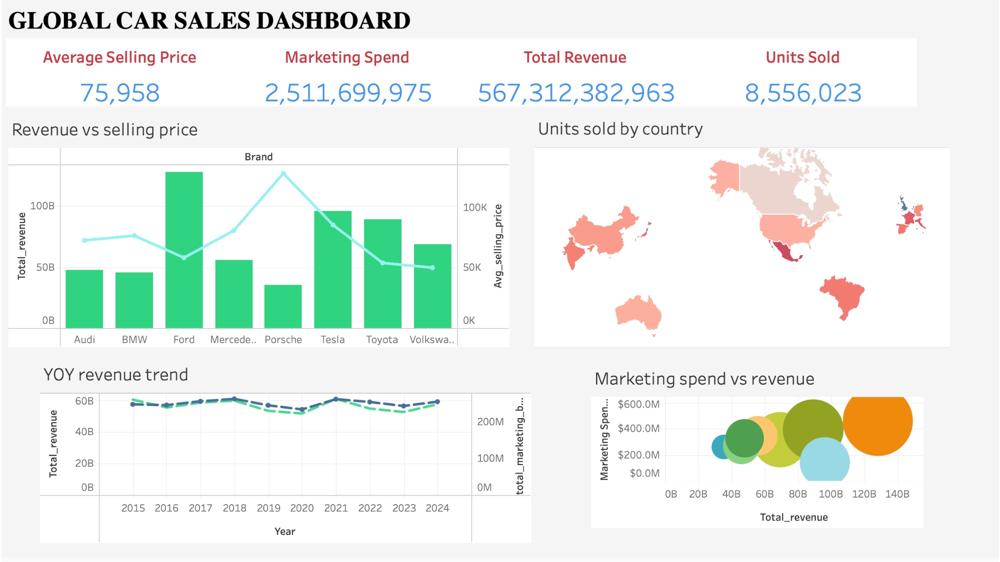

# Global Car Sales — Data Cleaning & Preprocessing

A Python-based data cleaning and preprocessing pipeline for the **Global Car Sales** dataset. The notebook systematically transforms raw, messy CSV data into a clean, analysis-ready dataset.

---

## Repository Structure

```
├── cleaning.ipynb          # Main data cleaning notebook
├── global_car_sales.csv    # Raw input dataset
├── cleaned_data.csv        # Intermediate cleaned output
└── final_dataset.csv       # Final clean dataset (primary output)
```

---

## Dataset Overview

The raw dataset (`global_car_sales.csv`) contains **8,991 rows × 15 columns** of global car sales records spanning multiple brands, countries, and years.

| Column | Description |
|---|---|
| `brand` | Car manufacturer (e.g. Toyota, Tesla, BMW) |
| `year` | Year of sale |
| `month` | Month of sale (1–12) |
| `country` | Country of sale |
| `model` | Car model name |
| `segment` | Vehicle segment (SUV, Sedan, Hatchback, etc.) |
| `engine_type` | Engine type (Electric, Petrol, Diesel, Hybrid) |
| `price_usd` | Vehicle price in USD |
| `marketing_spend_usd` | Marketing expenditure in USD |
| `dealership_count` | Number of dealerships |
| `fuel_price_usd` | Local fuel price in USD |
| `gdp_growth_percent` | Country GDP growth rate (%) |
| `interest_rate_percent` | Country interest rate (%) |
| `competition_index` | Market competition index |
| `units_sold` | Number of units sold |

---

## Cleaning Steps

### 1. Deduplication
- Detected and removed **108 duplicate rows**.

### 2. Missing Value Handling
- **`country`** & **`segment`**: Filled with column mode.
- **`engine_type`**: Filled per model group using the most frequent value (mode).
- **`price_usd`** & **`marketing_spend_usd`**: Filled using group median (by model, then by brand as fallback).
- **`fuel_price_usd`** & **`gdp_growth_percent`**: Filled using median grouped by country and year.
- **`dealership_count`**: Filled using median grouped by brand and country.
- **`units_sold`**: Rows with missing values were dropped entirely.

### 3. Spelling & Standardisation Corrections
- **`engine_type`**: Normalised case and corrected misspellings (e.g. `electrc` → `Electric`, `diesal` → `Diesel`, `petrole` → `Petrol`).
- **`country`**: Corrected variants (e.g. `Brasil` → `Brazil`, `U.S.A` → `USA`, `Germny` → `Germany`).
- **`segment`**: Corrected variants (e.g. `S U V` → `SUV`, `Sedaan` → `Sedan`).
- **`brand`**: Title-cased and corrected misspellings (e.g. `Bmw` → `BMW`, `Toyoda` → `Toyota`, `Teslla` → `Tesla`).

### 4. Data Type Conversions
- `price_usd` and `marketing_spend_usd`: Stripped `$` and `,` characters, then cast to numeric.
- `year`, `month`, `units_sold`: Converted to integer.
- `dealership_count`, `fuel_price_usd`, `gdp_growth_percent`: Converted to float.

### 5. Outlier & Validity Checks
- **`year`**: Values above 2025 set to `NaN` and subsequently dropped.
- **`month`**: Values outside 1–12 set to `NaN` and dropped.
- **`price_usd`**: Values exceeding $500,000 capped and then filtered out.
- **`units_sold`**: Negative values corrected using absolute value.
- **`dealership_count`**: Zero values replaced with brand-level median.

### 6. Segment Re-mapping
- Valid segments defined as: `SUV`, `Sedan`, `Hatchback`, `Truck`, `Coupe`.
- Each model mapped to its most common valid segment.
- Rows where `engine_type` is `Electric` have their segment set to `Electric`.
- `Suv` normalised to `SUV` in the final pass.

---

## Final Dataset

The final output (`final_dataset.csv`) contains **8,228 rows × 15 columns** with:
- ✅ Zero missing values
- ✅ No duplicates
- ✅ Consistent casing and spelling across all categorical columns
- ✅ Correct data types on all columns

**Segment values:** `Electric`, `Sedan`, `SUV`  
**Engine type values:** `Diesel`, `Electric`, `Hybrid`, `Petrol`

---

## Dashboard

The cleaned dataset powers an interactive **Global Car Sales Dashboard** with the following views.

🔗 **[Access the Dashboard here](https://public.tableau.com/shared/NKYYY4NRX?:display_count=n&:origin=viz_share_link)**



### KPI Summary (Top Bar)
| Metric | Value |
|---|---|
| Average Selling Price | $75,958 |
| Marketing Spend | $2,511,699,975 |
| Total Revenue | $567,312,382,963 |
| Units Sold | 8,556,023 |

### Charts

**Revenue vs Selling Price (by Brand)** — A combined bar + line chart comparing total revenue (bars) and average selling price (line) across all 8 brands. Ford and Tesla lead on revenue, while Porsche commands the highest average selling price.

**Units Sold by Country** — A choropleth world map with a red intensity scale showing geographic distribution of sales. China, the USA, and Brazil are among the strongest markets.

**YOY Revenue Trend (2015–2024)** — A dual-axis line chart tracking total revenue and total marketing budget year-over-year. Revenue remains relatively stable across the decade (~$55–60B annually per year), with a slight uptick in 2019–2020.

**Marketing Spend vs Revenue (Bubble Chart)** — A scatter/bubble chart where each bubble represents a brand, sized and coloured by marketing investment relative to total revenue. Highlights which brands are getting the most return per marketing dollar.

---

## Dependencies

```
numpy
pandas
matplotlib
seaborn
```

Install with:

```bash
pip install numpy pandas matplotlib seaborn
```

---

## Usage

1. Place `global_car_sales.csv` in the same directory as the notebook.
2. Open and run `cleaning.ipynb` top to bottom.
3. The cleaned output will be saved as `final_dataset.csv`.

---

## Acknowledgements

- **[Your Name]** — Data cleaning, preprocessing, and dashboard development.
- Dataset sourced from the Global Car Sales open dataset.
- Dashboard built with [Tableau Public](https://public.tableau.com).